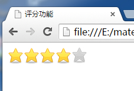

# 大纲 #

1. 节点属性
2. 节点操作
3. 事件(初步)


# 课堂内容 #


## 节点属性 ##

```
box.attributes;      // 节点中所有属性
box.getAttribute('data-index')  // 获取元素节点属性的值

box.setAttribute('data-index',2); // 设置节点的属性
box.removeAttribute('title') // 移除节点属性
```


### 网页换肤 ###

css 样式表在 css 文件夹
```
<link id="link" href="css/css1.css" rel="stylesheet" type="text/css" />


<dl id="message">
	<form>
		<dt>
			<strong>可以换肤的提交框：</strong>
			<input type="button" value="皮肤1" data-css="css1" />
			<input type="button" value="皮肤2" data-css="css2" />
		</dt>
		<dd>输入姓名：<input class="text" type="text" /></dd>
		<dd>输入密码：<input class="text" type="password" /></dd>
		<dd>请您留言：<textarea></textarea></dd>
		<dd class="center"><input class="btn" type="submit" value="提交" /></dd>
	</form>
</dl>

```


style CSS内联样式属性值
获取非行内样式的属性，必须要使用currentStyle（IE特有）
```
//var style = window.getComputedStyle("元素", "伪类");
var dom = document.getElementById("test");
style = window.getComputedStyle(dom , ":after");
```
//个别浏览器对第二个伪类不支持
className CSS元素的类 (不可以使用class)


### 进度条 ###


```
<style>
	#progress{
		position: relative;
		margin: auto;
		top: 200px;
		display: block;
		width: 200px;
		height: 20px;
		border-style: dotted;
		border-width: thin;
		border-color: darkgreen;
	}
	#filldiv{
		position:absolute;
		top: 0px;
		left: 0px;
		width: 0px;
		height: 20px;
		background: blue;
	}
	#percent{
		position: absolute;
		top: 0px;
		left: 200px;
		
	}
</style>


<div id="progress">
	<div id="filldiv"></div>
	<span id="percent">0</span>
</div>

```


## 节点操作方法 ##

DOM 不单单可以查找节点，也可以创建节点、复制节点、插入节点、删除节点和替换节点

```
createElement() //创建一个元素节点
createTextNode()  //创建一个文本节点
box.appendChild(node)  //把node节点插入到box的内部最后的位置
box.insertBefore(newNode, existNode)  //把newNode节点插入到exsitNode的前面
box.removeChild(node) // 在box内移除节点
box.replaceChild(p,h1); // h1替换成p

box.cloneNode(true) // 克隆节点

```

### 添加表格 ###


```
	<style>
		table{margin-top:20px;width:100%;border:1px solid #ddd;border-collapse: collapse;}
		td{padding:5px 15px;border:1px solid #ddd;}

		/*css3隔行变色*/
		/*table tr:nth-child(odd){
			background-color:#efefef;
		}*/
		.odd{background-color:#fc0;}
	</style>


行：<input type="text" id="row"> 列：<input type="text" id="col"><button>生成表格</button>
```


### 表格行复制 ###

node.cloneNode(true);

设置为 true，如果您需要克隆节点及其属性，以及后代
设置为 false，如果您只需要克隆节点及其后代

### 看你有多色 ###

```
		// i 所对应 行号 和 列号
		// 2*2
		// i:   行号  列号
		// 0     0    0
		// 1     0    1
		// 2     1    0
		// 3     1    1

    // oDiv = document.createElement("div");
	// oDiv.className = "block";
	// // 第一个方块的宽度 + 间隙
	// oDiv.style.left = (200 + 20) + "px";

	// gameBox.appendChild(oDiv);

```


如何改变方块的颜色？
	
```
oDiv.style.background = "#ff0000";
```

ff(16) = 1111 1111(2) = 2^8 - 1 = 256

---------
如何产生随机的颜色？

---------
产生特殊位置的颜色

在循环中判断特殊位置，设置成一个新的随机颜色即可


---------
在 div 元素上添加点击事件处理函数


---------
点对了： 重新创建方块(重新调用函数)

将代码封装成函数

---------
后期扩展

点对3次才升级
点错了的级别显示


## 事件初步 ##


### 下拉菜单 ###

事件对象 event

event.target // 当前时间触发的节点


# 作业 #
1. 评分效果
    

2. 下拉菜单

3. 看你有多色 【小游戏】

【扩展】 表格即时编辑

