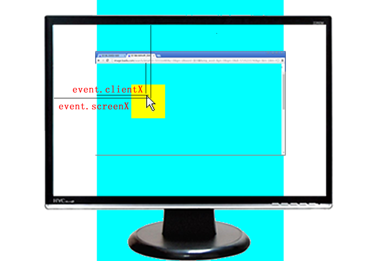
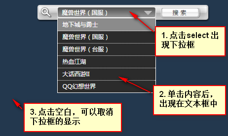
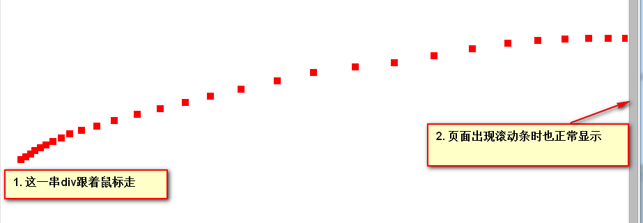

# 大纲 #

1. 事件流
2. 事件绑定
3. 事件对象


# 课堂内容 #

## 事件流 ##

事件流？
https://segmentfault.com/a/1190000003497939

当你单击了某个元素，单击事件不仅仅发生在这个元素上，你也单击了它的父元素、父元素的父元素、……它的祖先元素，甚至单击了整个页面。

### 表格的即时编辑 ###

### 事件委托 ###

【案例】即时编辑表格

【补充】字符串的大小写转换


## 事件绑定 ##

### DOM0级事件绑定 ###
DOM分为级别，DOM0级、1级、2级、3级，是不同的标准，标准一直在升级。
我们之前学习的
1	oDiv.onclick = function(){2	}
这种注册监听的写法，就是DOM0级的事件绑定方法。就是把onclick当做属性添加给了oDiv元素。


### DOM2级事件绑定 ###

冒泡事件


DOM1级规范中，没有对事件进行改动。
DOM2级做了新的规范，不用on***来绑定监听了，而是使用一个方法
1	addEventListener();
add添加，Event事件，Listener监听


它接受三个参数：什么事件、函数、是否监听捕获阶段。

```
1	oBox.addEventListener("click",function(){
2		
3	},false);

```

第1个参数：事件名不用写on，  click、mouseover 、mouseout
第2个参数：函数可以是匿名函数，也可以是有名函数
第3个参数：布尔值，true表示监听捕获、false表示监听冒泡阶段


#### 低版本IE的事件绑定 ####

IE永远是个奇葩，但是现在20%的用户在使用IE8，我们祝愿他们健康幸福。
IE6、7、8不支持addEventListener()方法，支持
1	oDiv.attachEvent(“onclick”,函数);
没有第三个参数，也就是说，不能选择监听捕获、冒泡。只能监听冒泡。

```
1	 box1.attachEvent("onclick", function(){
2	 	alert("box1");
3	 });

```

第一个参数，必须写on，和addEventListener()不一样；
第二个参数，就是事件处理函数
没有第三个参数，只能监听冒泡。所以和on***写法一样。


### 即时编辑 ###

### 事件委托 ###

【案例】即时编辑表格


## 事件对象 ##


Event 对象代表事件的状态，比如事件在其中发生的元素、键盘按键的状态、鼠标的位置、鼠标按钮的状态。


事件模型JavaScript标准参考教程
http://javascript.ruanyifeng.com/dom/event.html


事件对象注意点
https://segmentfault.com/a/1190000004290690


JavaScript Event对象详解
http://www.cnblogs.com/prince1988/archive/2009/04/04/1429525.html


任何的事件处理函数，我们的浏览器、JS引擎会默认往里面传一个实参，就是事件对象。
通常用形参event来接收：
```
1	oDiv.onclick = function(event){
2		console.log(event);
3	}

```

### 事件类型 ###

鼠标事件：
	onclick:点击
	onmouseover：鼠标放上
	onmouseout：鼠标离开
	ondblclick：双击事件  【注意是 dbl】
	onmousedown：鼠标按下
	onmouseup：鼠标抬起
	onmousemove：鼠标移动

表单事件：
	onfocus：获得焦点
	onblur：失去焦点
	onsubmit：提交事件
	onchange：当发生改变的时候
	onreset：重置事件

键盘事件：
	onkeyup：键盘抬起
	onkeydown：键盘按下
	onkeypress：键盘按键一次

窗口事件：
    onload事件: 页面加载完成之后立刻执行的事件


### 通用事件对象属性和方法 ###

● event.type 返回事件的类型，没有on， 比如”click”
● event.target 返回你点击的最小的那个元素，即使这个元素身上没有监听，也是返回它
● event.currentTarget	返回自己，this一定和event.currentTarget是一个元素，都是自己
● event.bubbles	返回一个布尔值，表示这个事件是否冒泡


```
1	oDiv.onmouseover = function(event){
2		console.log(event.bubbles); 
3	}

```

比如onmouesover的event.bubbles就是true;
但是onmouseenter的 event.bubbles就是false;
简称onmouseover冒泡，onmouseenter不冒泡。
onmouseover、onmouseenter IE6、7、8、9、10全面兼容！反而是chrome30之前不兼容。所以现在可以看做全线兼容，就嗷嗷用就完事儿了。


● stopPropagation() 停止传播事件流
1	event.stopPropagation();

● preventDefault() 阻止默认事件
1	event.preventDefault();

### clientX、clientY、screenX、screenY ###

```
event.clientX
event.clientY
event.screenX
event.screenY

全线兼容，表示事件触发这一瞬间的鼠标位置。
clientX表示鼠标的位置，距离浏览器窗口左边边的距离
clientY表示鼠标的位置，距离浏览器窗口上边边的距离
screenX表示鼠标的位置，距离屏幕左边边的距离
screenY表示鼠标的位置，距离屏幕上边边的距离

```



### IE中的event ###

IE浏览器的event对象是window对象的属性，而不是事件的实参。

2	document.onmousemove = function(event){
3	    event = event || window.event;
4	    document.innerHTML = event.clientX;
5	}


#### 【案例】鼠标跟随效果 ####

(扩展) 如何让鼠标始终在图片的中间位置呢？

```
// Firefox、chrome 浏览器 获取节点 bird 计算后的 css 样式值
var obj = getComputedStyle(bird);

// "120px" ---> 120
var w = parseInt(obj.width);
var h = parseInt(obj.height);
```


### 鼠标按键检测 ###
event.button

//如果当前event是鼠标事件，则会有一个button属性，它是一个数字
//W3C 规定 event.button 取值如下:
0代表鼠标按下了左键
1代表按下了滚轮
2代表按下了右键


不过老版本的IE并没有遵守W3C的规范，它的button属性含义如下
鼠标左键 1
鼠标右键 2
左右同时按 3
滚轮 4
左键加滚轮 5
右键加滚轮 6
三个同时 7

onmousedown: 鼠标点下的事件

### 键盘按键监测 ###
如果按下的是左方向键：keyCode==37
如果按下的是右方向键：keyCode==39
如果按下的是上方向键：keyCode==38
如果按下的是下方向键：keyCode==40


**chrome在线调试方式【重要！重要！重要！】**
F12 打开调试工具

1. 设置断点： 切换到 sources 标签中，单击行数，出现蓝色块说明设置成功。再次点击可以取消断点
2. 单步执行： F10 (快捷键)
3. 全速执行： F8 (快捷键)

中间如果想看变量的值，可以鼠标移动到变量上就会有提示


## 作业 ##

1. 所有案例全部重新写一遍。

2. 模拟select下拉菜单



```
	<style>
		html,body{height:100%;overflow:hidden;}
		body,div,form,h2,ul,li{margin:0;padding:0;}
		ul{list-style-type:none;}
		body{background:#23384e;font:12px/1.5 \5fae\8f6f\96c5\9ed1;}
		#search,#search form,#search .box,#search .select,#search a{background:url(images/search.jpg) no-repeat;}
		#search,#search .box,#search form{height:34px;}
		#search{position:relative;width:350px;margin:10px auto;}
		#search .box{background-position:right 0;}
		#search form{background-repeat:repeat-x;background-position:0 -34px;margin:0 20px 0 40px;}
		#search .select{float:left;color:#fff;width:190px;height:22px;cursor:pointer;margin-top:4px;line-height:22px;padding-left:10px;background-position:0 -68px;}
		#search a{float:left;width:80px;height:24px;color:#333;letter-spacing:4px;line-height:22px;text-align:center;text-decoration:none;background-position:0 -90px;margin:4px 0 0 10px;}
		#search a:hover{color:#f60;background-position:-80px -90px;}
		#search .sub{position:absolute;top:26px;left:40px;color:#fff;width:198px;background:#2b2b2b;border:1px solid #fff;display:none;}
		#search .sub li{height:25px;line-height:24px;cursor:pointer;padding-left:10px;margin-bottom:-1px;border-bottom:1px dotted #fff;}
		#search .sub li:hover{background:#8b8b8b;}
	</style>


	<div id="search">
		<div class="box">
			<form>
				<span id="select" class="select">请选择游戏名称</span>
				<a href="javascript:;">搜索</a>
			</form>
		</div>
		<ul id="sub" class="sub">
			<li>地下城与勇士</li>
			<li>魔兽世界（国服）</li>
			<li>魔兽世界（台服）</li>
			<li>热血江湖</li>
			<li>大话西游II</li>
			<li>QQ幻想世界</li>
		</ul>
	</div>
```

3. 鼠标跟随一串效果




