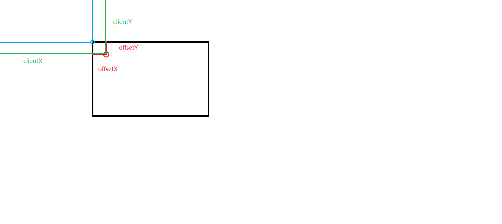
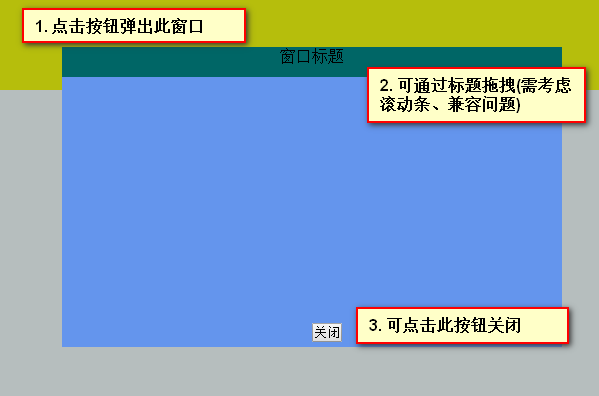

# 大纲 #

1. 窗口卷动
2. 阻止浏览器默认行为
3. 拖拽


# 课堂内容 #

## 窗口转动 ##


## 阻止浏览器默认行为 ##

### 阻止链接跳转 ###

```
其中： evt 为事件对象

// 阻止浏览器的默认行为的兼容写法
evt.preventDefault ? evt.preventDefault() : evt.retrunValue = false;


用于在 Firefox、chrome 等浏览器中组织的默认行为
evt.preventDefault()


// 用于在 IE 浏览器中阻止默认行为
evt.retrunValue = false

```


### 自定义右键菜单 ###

1. 右键后显示菜单
2. 点击空白位置取消菜单
3. 点击菜单内容不消失


## 拖拽 ##




### 【案例】拖拽效果 ###

鼠标移动过程中，要阻止掉默认的选中状态

```
var offsetX = e.offsetX ? e.offsetX : e.clientX - box.getBoundingClientRect().left;
var offsetY = e.offsetY ? e.offsetY : e.clientY - box.getBoundingClientRect().top;
```


```
// 阻止浏览器的默认行为
evt.preventDefault ? evt.preventDefault() : evt.retrunValue = false;
```

### 【案例】弹出层拖拽 ###

注意： 移动时要清除 margin 的设置

```
layer.style.margin = "0px"; //margin样式会影响运动效果
```

### 【案例】有滚动条的拖拽效果 ###

带滚动条的拖拽

```
var offsetX = e.offsetX;
var offsetY = e.offsetY;


var scrollTop = document.body.scrollTop || document.documentElement.scrollTop;
var scrollLeft = document.body.scrollLeft || document.documentElement.scrollLeft;

document.onmousemove = function(e) {
	var x = e.clientX - offsetX + scrollLeft;
	var y = e.clientY - offsetY + scrollTop;
}
```


### 【案例】完美拖拽 ###

1. 拖住标题滚动
2. 回放运动轨迹

保存数据到数组中的方法

```


// 定义一个点的空对象
var point = {};

// 在 point 对象中，新增了一个 x 的属性，值为 x
point.x = x;
point.y = y;

// 将 point 对象压入到 arr 数组中
// 相当于，每移动一次，将会将这个点添加数组
// 而且，添加的点是有顺序的
arr.push(point);
```

---------
回放代码

```
var i = 0;
var timer = setInterval(function() {
	var point = arr[i];

	box.style.top = point.y + "px";
	box.style.left = point.x + "px";

	i++;

	if (i >= arr.length) {
		// 已经到数组中的最后一个元素
		clearInterval(timer);

		// 已经完成动作了，清空整个数组
		arr = [];
	}

}, 10);
```


### 【案例】360度全景展示效果 ###

1. 鼠标拖拽旋转
2. 自动旋转

鼠标拖拽旋转: 

1. 按下键，mousedown 开始拖拽 document.onmousemove , 起始横坐标点 startX = e.offsetX
2. document.onmousemove  事件处理函数中，得到 终止点横坐标 endX = e.offsetX
3. endX - startX 得到图片的便宜量， 有正有负
     正： 图片的编号 越来越大
	 负： 图片的编号 越来越小
    更新图片

4. 松开键的时候， document.onmousemove = null;


# 作业 #

1. 弹出窗口


2. 完美拖拽
可回放拖拽轨迹

